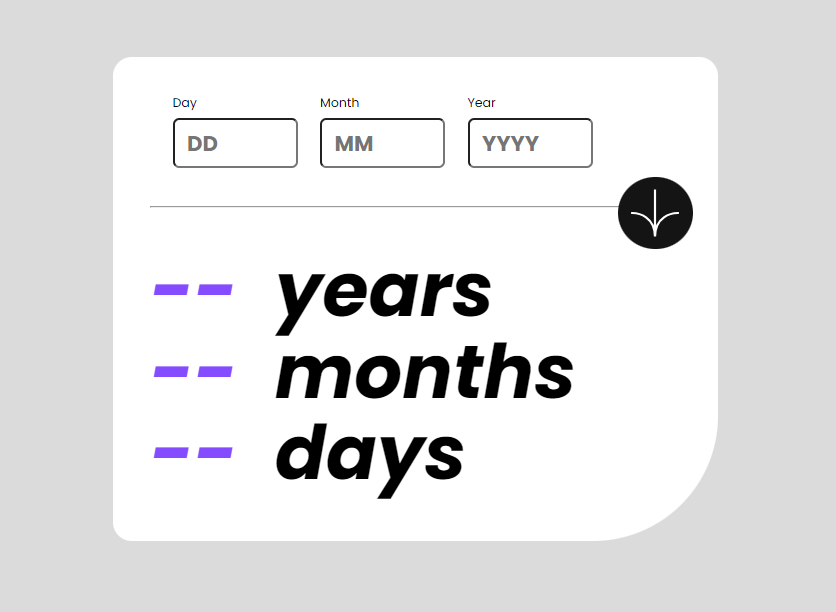

<h1>🎂 AgeCalculator App 🎉</h1>

Welcome to the Age Calculator App! This simple web application helps you calculate your age based on your birth date.

<h3> 🚀 Features</h3>
<ul>
<li> **Easy-to-Use Interface:** Simply enter your birth date, and the app will calculate your age for you.</li>
<li> **Error Handling:** The app provides helpful error messages if you enter invalid dates.</li>
<li>**Responsive Design:** Enjoy a seamless experience across devices, whether you're on desktop, tablet, or mobile.</li>
</ul>
<h3> 📸 Screenshots</h3>
</img>

<h3> 🛠️ Technologies Used</h3>

- HTML5
- CSS3
- JavaScript

<h3>📝 License</h3>
This project is licensed under the MIT License - see the LICENSE file for details.
<h3>Contributing 🤝</h3>

Whether you spot a bug, have a brilliant feature idea, or want to contribute code improvements, we welcome your contributions with open arms. Create an issue or submit a pull request.

